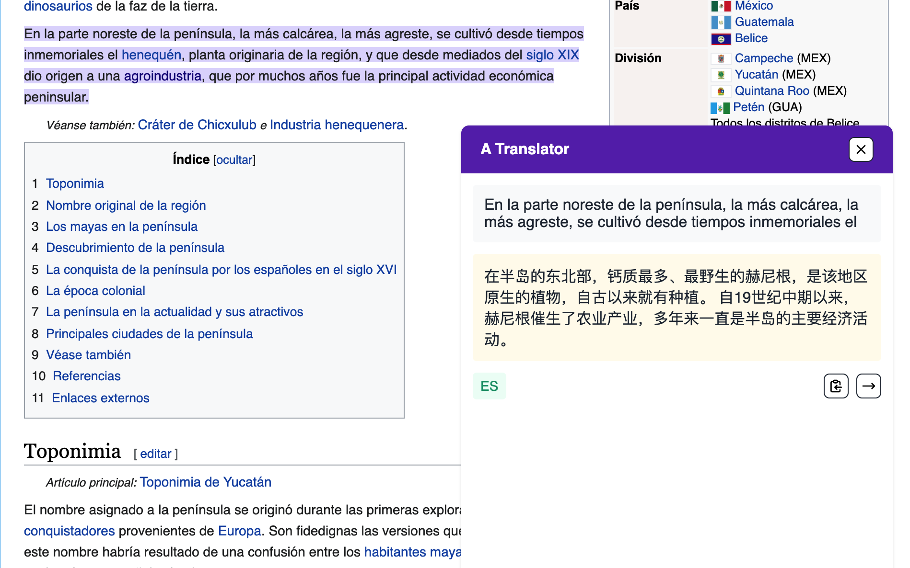

# a-translator-chrome-extension

## 安装

### Chrome Web Store

### 直接下载 crx 文件（Edge, 360 浏览器、猎豹浏览器等）

点击 [这里](https://drive.service.dada.li/A%20Translator/Chrome%20Extension/) 下载，然后将 crx 文件拖入「插件」页面即可安装。

### 本地安装插件

点击 [这里](https://github.com/geekdada/a-translator-chrome-extension/releases/latest/download/extension.zip) 下载最新版本的插件，开启「开发者模式」后将 zip 文件拖入「插件」页面。

## 配置

请在插件配置页面填入 A Translator 的 [API Token](https://a-translator.royli.dev/dashboard/profile)。

## 使用

在网页内选择内容即可点击图标翻译。

## License

[MIT](./LICENSE)
